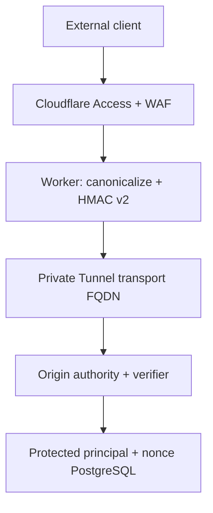
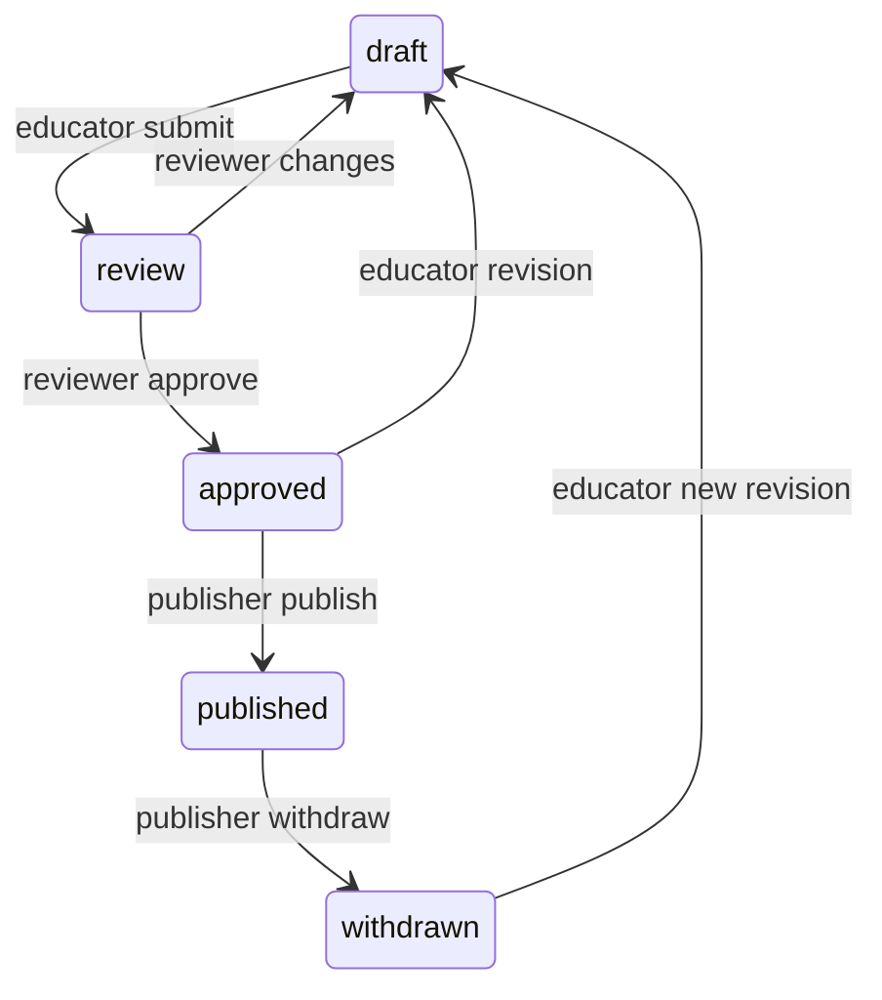

# CZA Faz 3 / Kapı 1B v4 — Offline Uygulanabilirlik Şartnamesi

Bu paket yalnız P0-B statik uygulama üretimidir. Provider mutation, provider authentication, backend bağlantısı, `plan`/`apply`, workflow çalıştırma, migration, production erişimi, push, merge ve deploy bu üretim turunda yapılmamıştır. P1 kapalıdır.

## Kapı sırası

| Aşama | Bağlayıcı sonuç |
|---|---|
| P0-A | Normatif kontratlar denetlenir. Provider mutation yoktur. |
| P0-B | IaC, Worker, origin verifier, OIDC, WAL ve testler üretilir. Provider mutation yoktur. |
| P0-C | İmzalı paketin bağımsız statik yeniden denetimi yapılır. |
| P1 | Yalnız P0-C kararı ve ayrıca yazılı izinle, süre sınırlı izole staging oluşturulabilir. |
| P2 | Gerçek staging üzerinde K1–K12 kanıtları üretilir. |
| P3 | Staging kabul kararını bağımsız karar organı verir. |

## Edge → Tunnel → Origin

Public authority yalnız `phase2-staging.example.invalid` sınıfındaki P1 girdisidir. Worker route yalnız `/phase2*` kapsamındadır. WAF, `http.request.headers` çoklu-değer görünümünde header truncation, duplicate Content-Type ve istemci tarafından gönderilmiş `x-cza-*` güven header’larını Worker’dan önce reddeder. Late Transform spoofable IP/header değerlerini kaldırır ve `x-cza-edge-policy-version`, `x-cza-edge-header-state=complete`, `x-cza-edge-raw-target` değerlerini edge otoritesi olarak yeniden yazar.

Worker public authority ve route’u yeniden doğrular; C0/DEL, encoded separator, invalid UTF-8, empty member, double slash ve cross-host girdilerini fail-closed reddeder. Transport URL hiçbir zaman public FQDN veya internal origin authority olamaz; böylece self-recursion ve internal-host bypass kapanır. Tunnel yalnız transport FQDN’i `origin_service_url` hedefine taşır ve Host’u `origin_service_authority` yapar; terminal ingress `http_status:404` olur.

Origin, public authority’yi gelen Host’tan türetmez. İmzalı `raw-target`, canonical target, method, content type, body hash, Access JWT hash, audience, route, timestamp, nonce ve request ID alanlarını yeniden kurup doğrular. HMAC içindeki `role-metadata=edge-authn-only` authorization kaynağı değildir. Yetki yalnız korunan PostgreSQL principal/academy/role kaydından gelir.

## Canonical ve replay kontratı

- Raw request target ve Content-Type yalnız visible ASCII kabul eder; SP/HTAB yalnız Content-Type OWS sınırlarında anlamlıdır.
- Literal veya percent-decoded `0x00–0x1F` ve `0x7F` reddedilir.
- Encoded slash/backslash, dot segment, invalid percent/UTF-8, literal `+`, empty path/query member reddedilir.
- Query anahtar/değerleri NFC sonrası UTF-8 percent encoding ile uppercase hex biçiminde sıralanır; repeated key ordinal kararlılığı korunur.
- Geçmiş pencere 60 s, future skew 5 s, cleanup payı 15 s, nonce retention 80 s’dir. `80 >= 60 + 5 + 15` zorunludur.
- PostgreSQL `INSERT ... ON CONFLICT DO NOTHING` aynı nonce’ı atomik tek kullanımlı yapar. Retention sonrasındaki eski imza zaten freshness kontrolünden geçemez.

## RBAC ve tenant

Self-approval yasaktır; author, reviewer ve publisher ayrıdır. `approved → withdrawn` doğrudan yasaktır. Cross-tenant lookup `404` ile kapanır. Cloudflare Access yalnız kimliği doğrular; pedagojik rolün nihai kaynağı origin’in korunan tenant üyelik kaydıdır.

## P0/P1 ayrımı ve recovery

`p0-static` sıfır provisioning yüzeyidir. Guard, `apply`, `destroy` ve `import` için exit 23 üretir; herhangi bir resource/data/module/provider/backend/provisioner bloğu eklenirse reddeder. `p1-provision` ayrı köktür ve varsayılan olarak hiçbir workflow tarafından çağrılmaz.

P1 workflow’da provisioning, PostgreSQL kurulumu ve cleanup mutation’larının her biri için sıra `PREPARED → WAL_DURABLE → REQUESTED → OBSERVED → RECONCILED` olur. Her mutation’dan önce journal fsync edilir, Actions artifact deposuna yüklenir, yeniden indirilip hash ile doğrulanır ve `REQUESTED` durumu da harici olarak saklanır. Mutation wrapper son durum `REQUESTED` değilse provider binary’sini çağıramaz; P0-C özeti, üç exact scope, en çok 900 saniyelik credential, en çok dört saatlik kaynak ömrü, staging authority’leri ve sabit provider egress kümesi birebir uyuşmazsa fail-closed olur. Response kaybında cleanup, resource ID’ye bağımlı kalmadan `run_id + deterministic label + provider discovery/audit` ile bütün kaynak sınıflarını siler ve ikinci keşifte sıfır canlı kaynak görmeden `RECONCILED` yazmaz.

## OIDC ve supply chain

Repository kimliği read-only GitHub metadata’dan `repository_id=1359513274`, `repository_owner_id=219684352` olarak çözülmüştür. Issuer, custom audience, environment, event, ref, empty head/base refs, caller `workflow_sha`, reusable `job_workflow_ref` ve `job_workflow_sha` exact-match’tir; tek mismatch `DENY` olur. Repo 6 Eylül 2026’da oluşturulduğundan immutable subject biçimi owner/repo numeric ID’lerini içerir.

Actions tam 40 karakter commit SHA ile sabittir. Çağıran workflow final kaynak commit’ine, reusable workflow onu içeren ayrı değişmez commit’e bağlanır; OIDC policy aynı `workflow_sha`, `job_workflow_ref` ve `job_workflow_sha` değerlerini exact-match doğrular. OpenTofu 1.12.0 ve provider sürüm/checksumları lock dosyalarında sabittir. Doğal Linux provider-schema kanıtı yalnız değişmemiş yayımlanmış binary ile üretilebilir; adapter/shim yasaktır.

## Doğal Linux kanıt kapısı

Teslim ortamındaki AF_UNIX kısıtı nedeniyle Cloudflare/Neon plugin protokolü burada çalıştırılmamıştır; bu durum `provider-proof-status.json` içinde açıkça kayıtlıdır ve PASS olarak sunulmaz. ZIP’in tek giriş noktası olan `scripts/faz3/run-offline-gate-v4.sh`, temiz doğal Linux x64 ortamında imzalı envantere bağlı OpenTofu 1.12.0’ı ve değişmemiş provider binary’lerini ağ erişimi olmadan, `-lockfile=readonly` filesystem mirror üzerinden kurar; gerçek AF_UNIX soketini sınar ve tam provider schema yüzeyini üretir. Adapter, development override, reattach, provider credential, harici CLI config veya plugin cache tespit edilirse kapı kapanır. Dinamik kanıt final source commit’i, provider lock hashini, OpenTofu binary hashini, provider sürüm/binary hashlerini ve tam schema envanterini taşır; imzalı manifestte hashlenmiş doğrulayıcı bu kanıt olmadan teslimi kabul etmez.

Manifest ayrıca bütün `.github/workflows` dosyalarının tam ve değişmez kümesini içerik hashleriyle, Faz 3 kaynaklarını yerel feature branch commit/tree kimliğiyle ve kullanılan Node/toolchain dosyalarının eksiksiz envanterini SHA-256 ile bağlar. Teslim ZIP’i komşu çalışma ağacına veya ağa ihtiyaç duymadan temiz dizinde açılarak aynı kapıyı çalıştıracak şekilde üretilir. Kapı herhangi bir vendored dosyayı çalıştırmadan önce imza, git tree, workflow kümesi ve toolchain envanterini doğrular. Bu tur provider mutation, workflow tetikleme, migration, push, merge veya deploy yapmaz; P1 kapalıdır.
